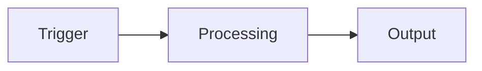

# <Feature Name>

## Overview

(1–3 lines describing what the feature does and its role in the system)

---

## Architecture

(REQUIRED — use `flowchart LR` or `flowchart TD` to show how the feature works end-to-end. Simplify rather than omit.)

---

## Key Files

| File | Role |
|------|------|
| `path/to/entry.ts` | Entry point — describe what it does |
| `path/to/component.tsx` | Main component — describe responsibility |

---

## Implementation Notes

- Constraints or invariants to preserve
- Non-obvious decisions and why they were made
- Gotchas or pitfalls for future developers

---

## Dependencies

- `module-name` — how it is used
- `external-package` — what it provides
