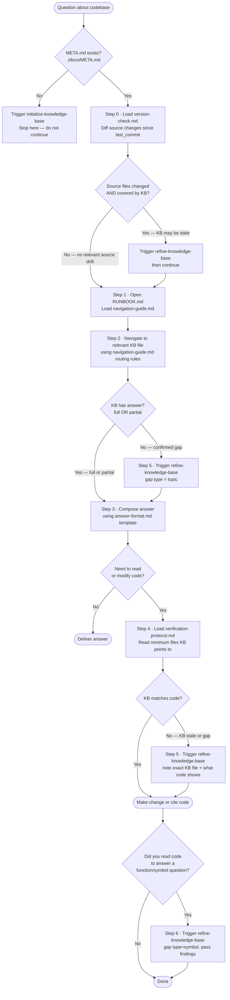

## Process Flowchart

Follow this flowchart exactly. Every node is mandatory — do not skip or shortcut any branch.



---

## First Principle

**The KB is the routing and shared-memory layer. Source code is the ground truth.**

Use the KB first to locate context, reduce search space, and preserve project knowledge.
Read the smallest necessary source surface when correctness requires it:

- implementing or modifying code
- verifying a KB claim before acting on it
- answering a missing symbol/function question through the symbol fast path
- resolving a confirmed KB gap or stale KB claim

Do not browse source code blindly. Complete the KB lookup first, then read only the files
the KB or confirmed gap points to.

When source and KB disagree, update the KB through `refine-knowledge-base` before
claiming the knowledge is current.

---

## What You Must Do

Follow this loop exactly — do not skip steps:

```
0. Run version-check.md — verify KB is current before reading anything
1. Open ./docs/RUNBOOK.md
2. Navigate to the relevant KB file using navigation-guide.md
3. Compose answer using answer-format.md
4. If you need to touch code or verify behavior → run verification-protocol.md first
5. If KB is wrong or missing → trigger refine-knowledge-base, then continue
6. If you read code to answer a function/symbol question → trigger refine-knowledge-base with:
     gap type = symbol, findings = <your findings>
   (subagent dispatch is skipped when findings are provided)
```

**NEVER open source code before completing steps 0–3.**
**NEVER open broad source areas when a KB path or confirmed gap gives a smaller scope.**
Never open RUNBOOK.md before completing step 0.
explore-repository NEVER writes to ./docs/ directly — all writes go through refine-knowledge-base.

---

## Sub-files

### Load `version-check.md` first — before navigation-guide.md or any KB file.

It compares `last_commit` from META.md against the current HEAD using `git diff --name-only last_commit HEAD -- ':!docs'` to detect whether source code (excluding docs/) has changed since the last sync.
If changes are found, it checks whether changed files are referenced in KB index files (`03_index/file_index.md` or `04_modules/*.md`) or look like new source files that should be indexed.
KB-covered source changes and new app source files trigger a refine; generated/cache/noise files can be ignored.
If META.md does not exist → skip and trigger `initialize-knowledge-base` instead.

### Load `navigation-guide.md` immediately after version-check passes.

It tells you which KB file to open for each type of question or task.
Without it you will guess file locations — that defeats the purpose of the KB.

### Load `answer-format.md` before composing any answer.

It defines two templates: Function-Level (Chain, Behavior, Signature, Constraints) and
File/Module/Feature (Big Picture, Context, Range). Apply the narrowest-scope template first.
Without it answers will be raw file dumps instead of structured, agent-readable responses.

### Load `verification-protocol.md` only when you are about to read source code.

It tells you how to compare what the KB says against what the code actually does,
and what action to take when they disagree.
If you skip it, you risk silently using stale information or ignoring a KB gap.
