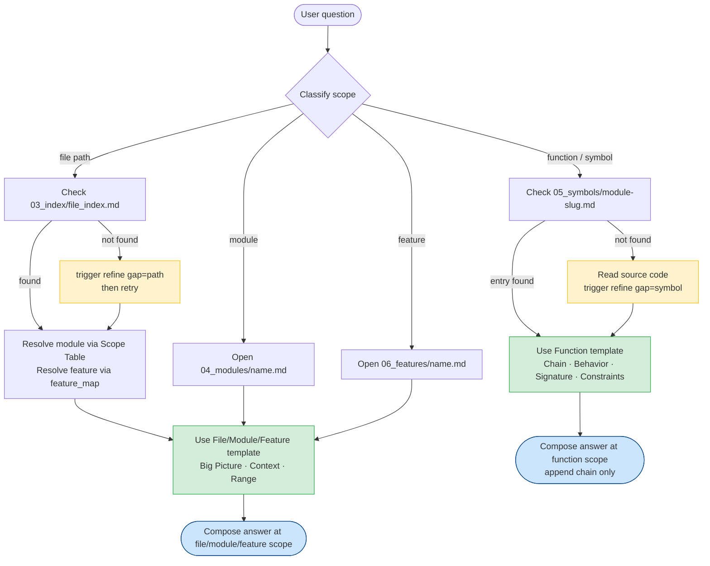

# Navigation Guide

## Starting Point

Always open `./docs/RUNBOOK.md` first.
It is the router — it tells you where everything lives.

---

## Progressive Disclosure Flowchart

---

## Navigate by Intent

### "What does this project do?"
1. `./docs/00_overview/big_picture.md`
2. `./docs/01_maps/system_map.md`

### "What tech stack / dependencies?"
1. `./docs/00_overview/tech_stack.md`

### "Where is feature X?"
1. `./docs/01_maps/feature_map.md` — search for feature name
2. Follow link to `./docs/04_modules/<name>.md`

### "Where is module / folder X?"
1. `./docs/01_maps/module_map.md` — find module
2. Open `./docs/04_modules/<name>.md` → Key Files section

### "What does function/symbol X do?"
1. `./docs/03_index/file_index.md` — find the source file that contains the function
2. `./docs/05_symbols/<module-slug>.md` — look up the function entry
3. If found → compose answer using `answer-format.md` (function scope) — no code read needed
4. If not found → read the source file, find the function → trigger `refine-knowledge-base` (gap type=symbol, findings in hand) → compose answer

### "What does file path X do?"
1. `./docs/03_index/file_index.md` — get the one-line meaning of the path
2. `./docs/04_modules/` — find which module's Scope Table lists this path (Implementation or Consumer row)
3. `./docs/01_maps/feature_map.md` — find which feature points to that module
4. Compose answer using `answer-format.md` — the file belongs to a module which belongs to a feature

### "How do I run / build / deploy?"
1. `./docs/02_guides/dev.md` — local development
2. `./docs/02_guides/deploy.md` — build and deploy
3. `./docs/02_guides/debug.md` — debugging

### "How do I add a feature / fix a bug / refactor?"
1. `./docs/02_guides/dev.md` — local workflow, test, and run commands
2. `./docs/02_guides/debug.md` — debugging workflow and known issues
3. `./docs/01_maps/module_map.md` — find the module likely to change

### "Tell me about completed feature X"
1. `./docs/01_maps/feature_map.md` — find feature link
2. `./docs/06_features/<kebab-name>.md`

---

## Navigation Order (general exploration)

1. `RUNBOOK.md` → get bearings
2. `00_overview/big_picture.md` → understand intent
3. `01_maps/feature_map.md` or `module_map.md` → locate scope
4. `04_modules/<name>.md` → understand responsibilities
5. `03_index/file_index.md` → find exact files
6. Open the smallest necessary code scope only after completing steps 1–5

---

## Stop Conditions

Stop reading KB and proceed to answering when:
- For function questions: you have the symbol entry from `05_symbols/` (chain: symbol → file → module → feature)
- For file questions: you have the file path, its module, and its feature
- You have enough context to fill all parts of `answer-format.md` at the appropriate scope level

Stop reading KB and proceed to code when:
- KB gives you a specific file path to act on
- You've confirmed a gap (→ use `refine-knowledge-base`)
- You need source-grounded verification before implementing or changing behavior
