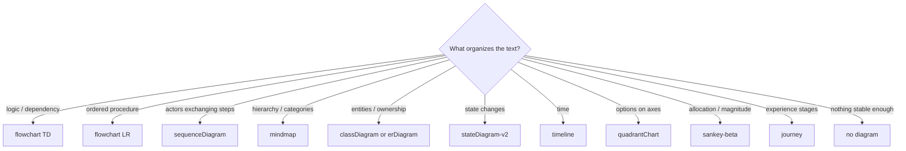
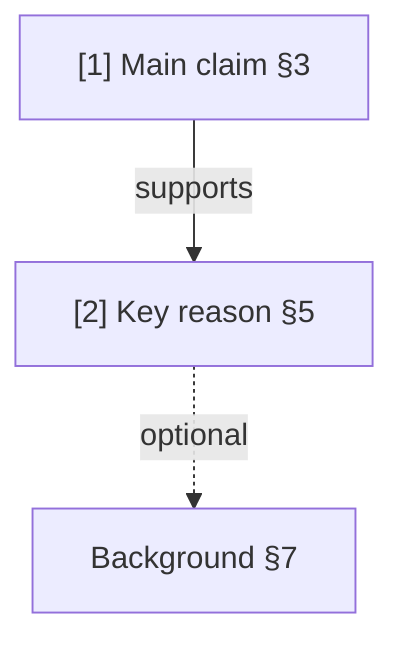
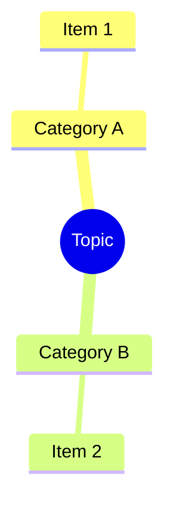
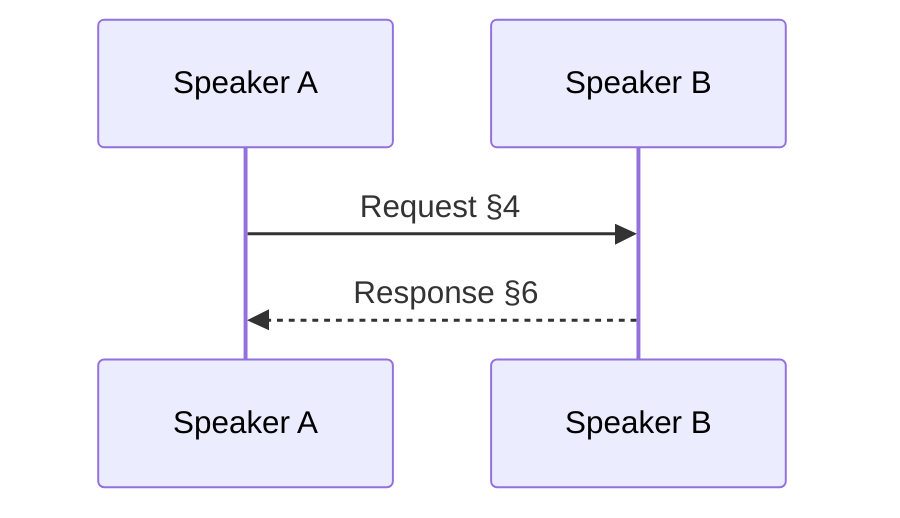
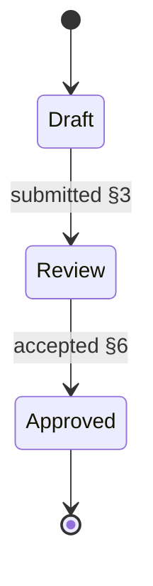
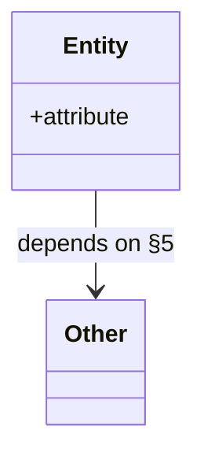
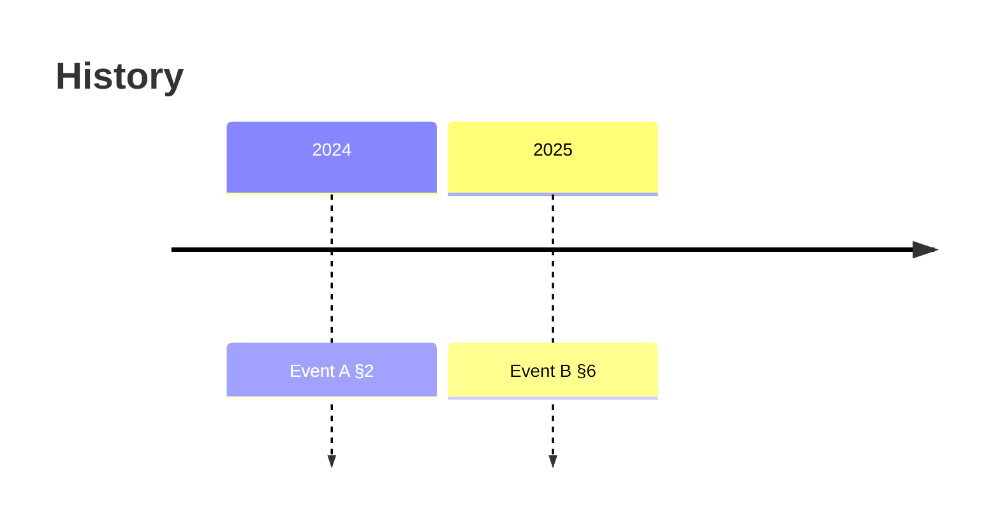
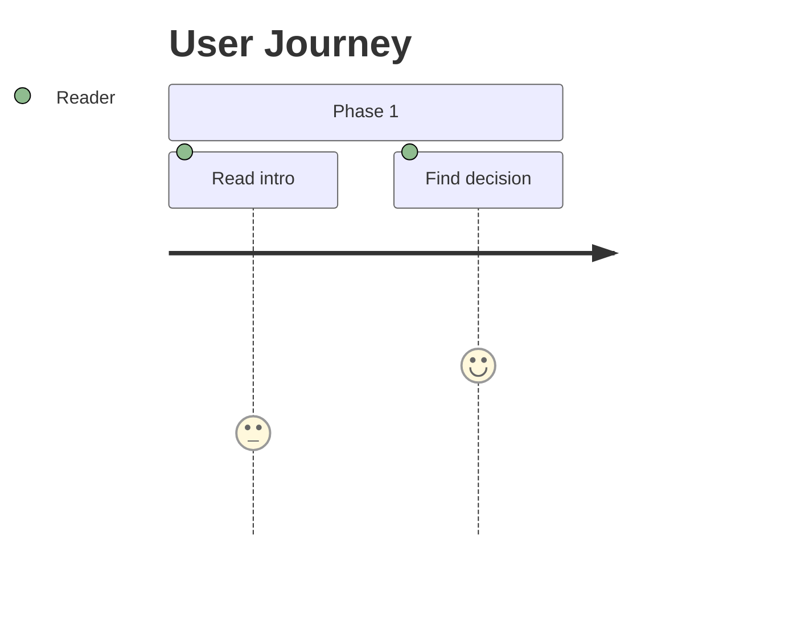

# Diagram Type Selection

Choose the representation that reveals the text's structure with the least distortion.

Use Mermaid when the visual payoff is real. If a diagram would fake clarity the source does not contain, fall back to a lighter reading-order artifact.

## Decision Matrix

| Text Pattern | Signals | Best representation | Notes |
|---|---|---|---|
| Argument / reasoning chain | "therefore", "because", "however", thesis + supports | `flowchart TD` | Best default for most prose |
| Process / how-to / tutorial | ordered steps, branching procedure | `flowchart LR` or `sequenceDiagram` | Use sequence only if actor/message exchange matters |
| Taxonomy / classification | categories, hierarchy, "types of" | `mindmap` | Good when grouping matters more than causal flow |
| Entity / relation | nouns with properties, ownership, parts | `classDiagram` or `erDiagram` | Use only when the text is genuinely entity-centric |
| States / lifecycle | transitions, phases, triggers | `stateDiagram-v2` | Good for systems and status changes |
| Chronology / history | dates, sequence over time | `timeline` | Use only when time is the primary organizing axis |
| Comparison / trade-offs | options, axes, pros/cons | `quadrantChart` | Use sparingly; requires defensible axes |
| Flow quantities / allocation | movement of budget, resources, percentages | `sankey-beta` | Only when magnitudes matter |
| Narrative / experience | stages, actors, sentiment | `journey` | Better for human experience than logic chains |
| Weak / messy structure | transcript drift, mixed notes, fragmented prose | no diagram or minimal flowchart | Prefer honesty over forced visual structure |

## Selection Heuristics

Ask in this order:
1. What would help a reader decide what to read first?
2. Is the source organized by dependency, sequence, hierarchy, state, or time?
3. Would a diagram clarify that, or just decorate it?

Default to `flowchart TD` when:
- the text has a thesis, decision, or core claim
- supporting points connect by logic or dependency
- another type would hide the important path

Prefer no diagram when:
- the source is mostly filler with a few isolated useful points
- the structure is too weak to map truthfully
- the reading guide alone is more honest than a fabricated visual

## Quick Selection Flow

## Mermaid Syntax Quick Reference

### flowchart TD/LR

### mindmap

### sequenceDiagram

### stateDiagram-v2

### classDiagram

### timeline

### journey

## Style Rules

1. Keep labels short enough to scan quickly.
2. Include `§N` references wherever the diagram type supports them naturally.
3. Use edge labels for flowcharts and similar graph types when they add clarity.
4. Use numbered reading order only when it improves navigation; do not force it on every diagram type.
5. Keep the visible map small; group or simplify beyond 12 nodes.
6. Optional context should be visually secondary only when the chosen type can express that cleanly.
7. If the text needs multiple diagrams, choose the one that best preserves the fast path.
