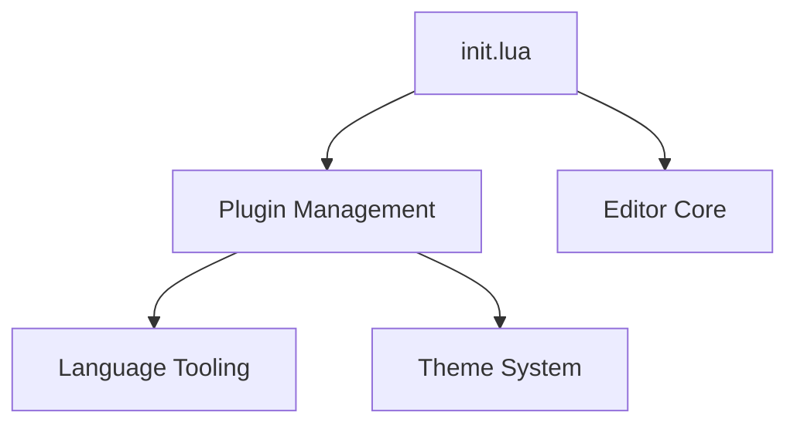

# Module Map

```mermaid
graph TD
  Init[init.lua] --> Lazy[Plugin Management]
  Init --> Core[Editor Core]
  Lazy --> LSP[Language Tooling]
  Lazy --> Theme[Theme System]
```

- plugin management → `lua/config/lazy.lua`
- language tooling → `lua/config/lspconfig.lua`
- editor core → `lua/config/options.lua`
- theme system → `lua/focus-walker/init.lua`

