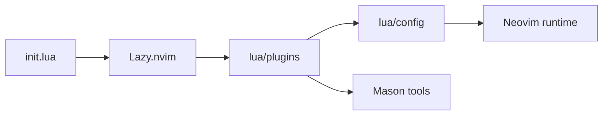

# System Map

- init → `init.lua`
- plugin loading → `lua/config/lazy.lua`
- plugin specs → `lua/plugins/*`
- runtime config → `lua/config/*`
- external tools → Mason packages configured in `lua/plugins/lsp.lua`

